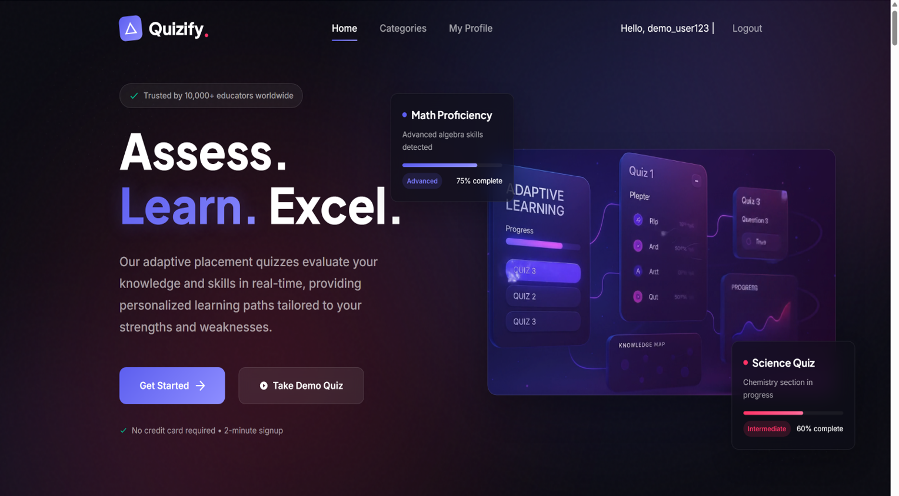
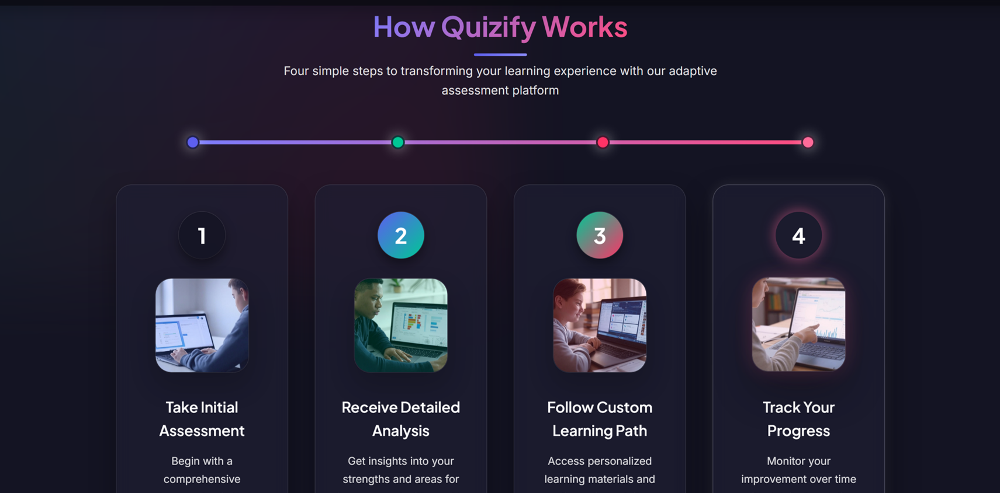
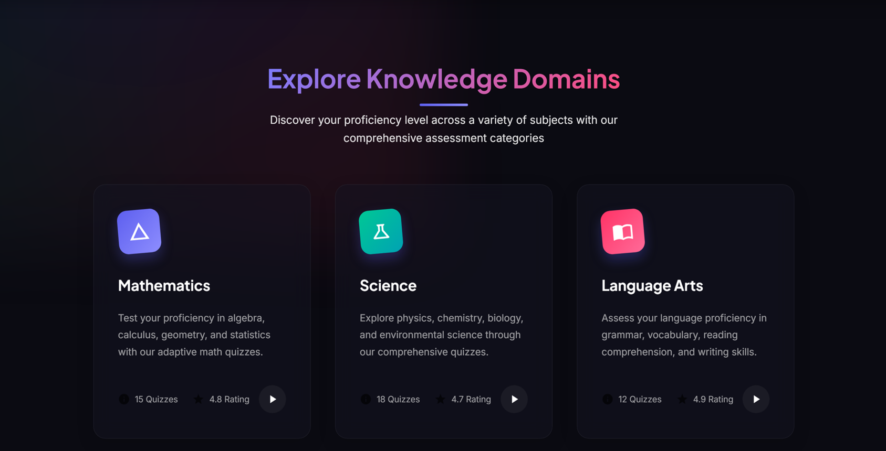
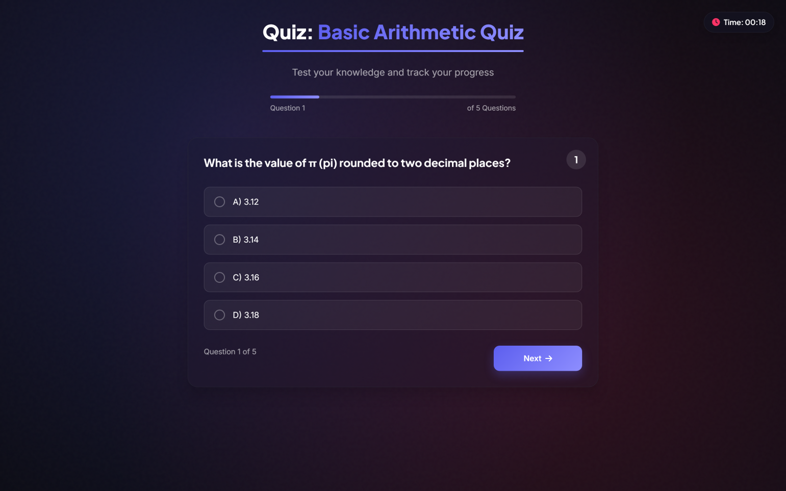
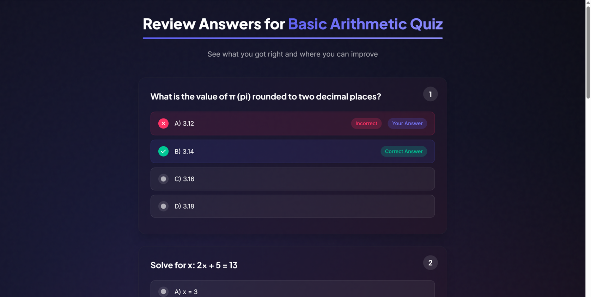
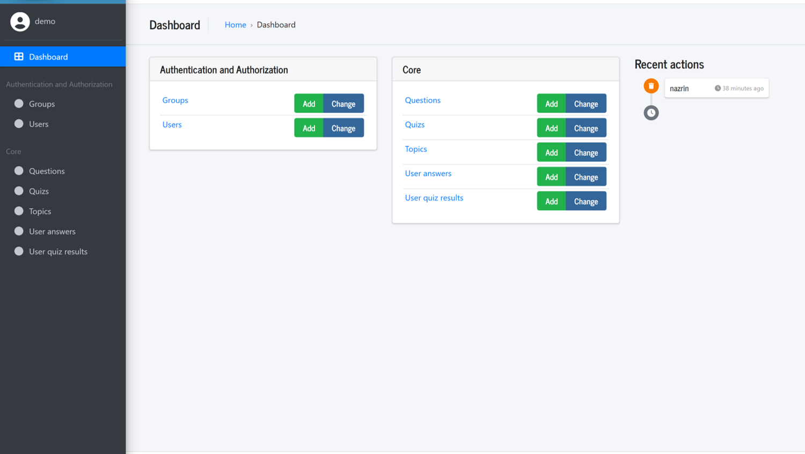

# Quizify

## An Interactive Web-Based Quiz Platform

**Presented by:** Group 4

Quizify is a web-based quiz application built for skill-based assessment and preparation. Users can sign up, take topic-wise quizzes, receive instant results, and track their performance through analytics and leaderboards.

## Why Quizify?

- Promotes self-assessment and skill-building.
- Helps identify individual strengths and weaknesses.
- Encourages healthy competition through a leaderboard.
- Supports preparation for exams, interviews, and certifications.

## Objectives

- Build a secure, user-friendly, interactive platform.
- Support topic-wise quizzes with instant results.
- Enable user registration, progress tracking, and analytics.
- Provide administrator tools for quiz and question management.

## Technology Stack

| Component | Tool / Technology |
| --- | --- |
| Backend framework | Django |
| Database | SQLite (scalable to PostgreSQL) |
| Frontend | HTML, CSS (Bootstrap), Django templates |
| Authentication | Django's built-in authentication system |

## Methodology

- Modular Django app structure using models, views, templates, and URLs.
- Form handling for registration and quiz submissions.
- Session management for login, logout, and saving results.
- Efficient database queries that display only the top 10 scores for each quiz.

## Features

### Administrators can

- Add and manage topics.
- Create and manage quizzes.
- Add and manage questions.
- View user performance.

### Users can

- Register and log in.
- Attempt quizzes.
- View scores and answer reviews.
- Track their progress.
- Check quiz leaderboards.

## Screenshots

### Home Page



### Quiz Topics and Dashboard





### Attempt a Quiz



### Result and Review




### Admin Panel



## Getting Started

```bash
python -m venv venv
venv\\Scripts\\activate
pip install -r requirements.txt
python manage.py migrate
python manage.py runserver
```

Open `http://127.0.0.1:8000/` in your browser.

